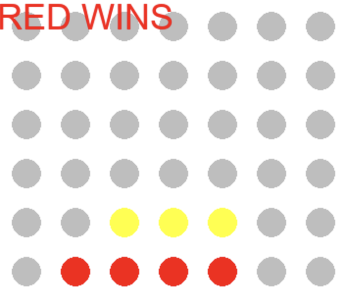
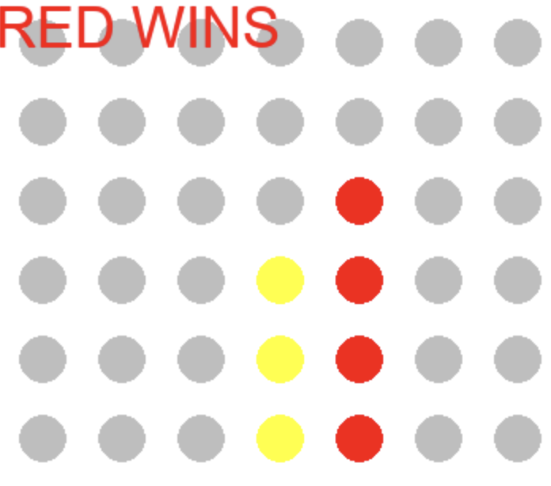
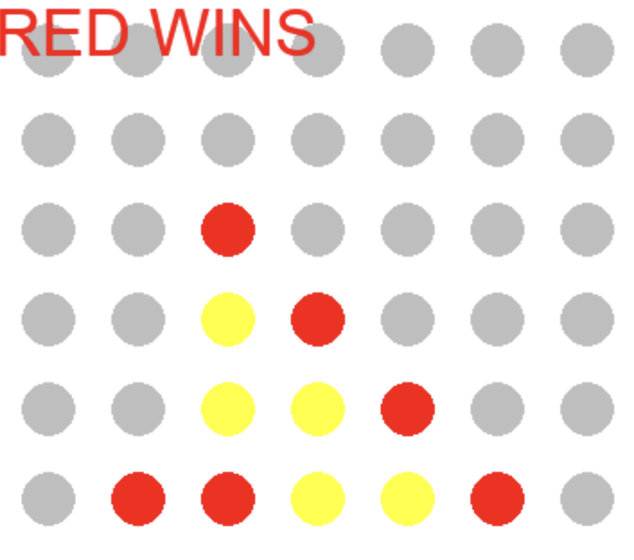

# Connect 4 

## How to play
- The goal of connect 4 is to get four of your chips in a row
- Red goes first, and then alternates with yellow until one player get four in a row or the board is full
- Clicking on any column drops your color chip into the bottom of that column
### Examples of wins

For more info, check out the [connect-4 wiki page](https://en.wikipedia.org/wiki/Connect_Four)

Note that Connect 4 is not my original game, and I do not claim to have designed it 